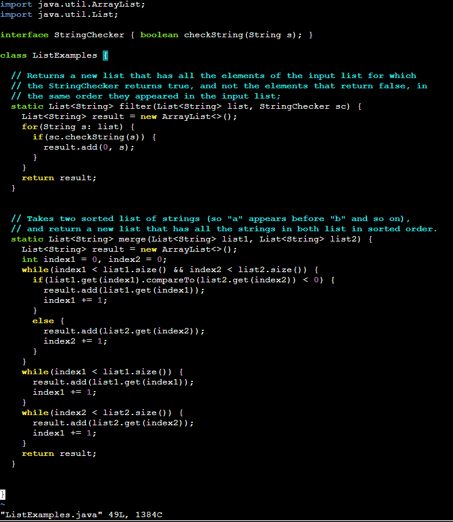

**Post**

I am having problem fixing the bug in ListExamples.java. By running `bash test.sh` I know there's a bug I need to change but I can't figure which part of the code I need to change.

**Response**

The hint that I can give you is the list the result is being store in. Think about what list should it be store in when it's the number behind it is 1 or 2.

**Post**

Thank you so much. I have realize the bug. The list it is being store in is index1 when the command is getting result from list 2. Therefore, I only need to change the list to index2.
